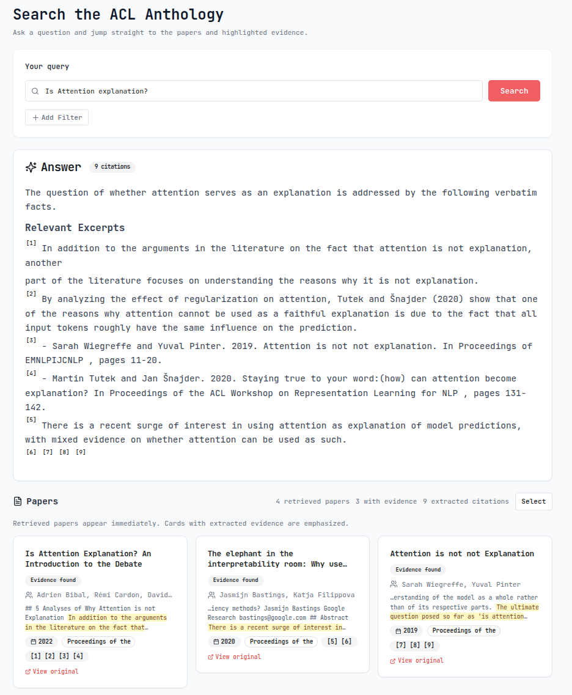

# ACL-Verbatim: Hallucination-Free Question Answering for NLP Researchers

*KR Labs · May 2026*

---

If you've ever used an AI assistant to search through research papers, you've probably run into the
same frustrating problem: the system sounds confident, cites a plausible-looking paper, and then
you check — and the detail it described doesn't quite exist in the source (if the source even
exists). This is the hallucination problem, and for researchers who need to trust their tools, it's
a dealbreaker. KR Labs has built [VerbatimRAG](https://huggingface.co/blog/adaamko/verbatimrag) for
transparent and trustworthy question answering, and you can now use it to search through all papers
in the ACL Anthology, the primary resource for research on natural language processing. Let's start
with some highlights:

- You can start querying NLP papers via **ACL-Verbatim** right now by going to **[verbatim.krlabs.eu](https://verbatim.krlabs.eu)**
- The **markdown version of all papers** in the ACL Anthology are released publicly as [KRLabsOrg/acl-anthology-md](https://huggingface.co/datasets/KRLabsOrg/acl-anthology-md) under CC
BY 4.0 (114K papers as of February 2026 and growing).
- All components are **free and open-source**. The [acl-verbatim](https://github.com/KRLabsOrg/acl-verbatim) repo can serve as a blueprint for deploying [verbatim-rag](https://github.com/KRLabsOrg/acl-verbatim) on any document collection.
- We also release our state-of-the-art **extraction models** and the underlying **span datasets**
    - [`KRLabsOrg/acl-verbatim-modernbert`](https://huggingface.co/KRLabsOrg/verbatim-rag-modern-bert-v1) has been trained on gold spans of the ACL data, released as [`acl-verbatim-spans`](https://huggingface.co/datasets/KRLabsOrg/acl-verbatim-spans)
    - [`KRLabsOrg/verbatim-rag-modern-bert-v2`](https://huggingface.co/KRLabsOrg/verbatim-rag-modern-bert-v2) is its generic counterpart trained on our multi-domain [`KRLabsOrg/verbatim-spans`](https://huggingface.co/datasets/KRLabsOrg/verbatim-spans) dataset

---

## What Is ACL-Verbatim?

ACL-Verbatim is an end-to-end question answering system over the [ACL
Anthology](https://aclanthology.org/) — the public library of 120,000+ papers in computational
linguistics and NLP — built on top of the [VerbatimRAG](https://github.com/KRLabsOrg/acl-verbatim)
framework. Instead of having a language model *generate* an answer (and risk fabricating details),
ACL-Verbatim identifies and returns **exact verbatim spans** from retrieved documents that are most
relevant to your query.

No paraphrasing. No synthesis. No hallucinations.



If the answer is in the ACL Anthology, the system should find the paper, retrieve the relevant
section, and highlight the precise passage that addresses your question. If it isn't there — or if
no retrieved chunk is sufficiently relevant — the system should tell you so, rather than making
something up.

---

## What We Built and Released

### 1. 114,000+ Papers Converted to Markdown

The backbone of the system is a large-scale conversion of the ACL Anthology to machine-readable
markdown. Starting from the February 2026 snapshot of the Anthology — 120,034 paper entries,
mapping to 114,567 PDFs under a permissive CC BY 4.0 license — we used the open-source
[Docling](https://docling-project.github.io/docling/) library to convert every PDF to markdown.

The result: **114,475 markdown files** covering the full text of papers including headers, tables,
lists, and figure captions, with other non-text elements replaced by placeholder annotations.

These files are released publicly on Hugging Face at
[KRLabsOrg/acl-anthology-md](https://huggingface.co/datasets/KRLabsOrg/acl-anthology-md) under CC
BY 4.0. Whether you want to build your own retrieval system, study the structure of NLP papers at
scale, or train document-understanding models, this is a resource you can use freely.

Papers are indexed using a custom chunking strategy built specifically for research papers: it
respects section boundaries, prefixes each chunk with section/subsection titles for better
retrieval, prevents tables and code blocks from being split, and controls chunk size (500–5,000
characters). Chunks are indexed both for full-text and dense vector search using IBM's
`granite-embedding-english-r2` embeddings.

---

### 2. A Ground Truth Dataset for Extractive QA over Research Papers

The harder and more novel contribution is a manually annotated benchmark for the task of
*extractive question answering* from research papers: given a user query and a retrieved chunk,
which spans of text in that chunk best answer the query?

We created a pipeline that generates **synthetic queries** based on the [ScIRGen
methodology](https://dl.acm.org/doi/10.1145/3711896.3737432). For each sampled paper, a random
chunk is selected, and an LLM generates question types and questions for that chunk, which are then
rewritten into short, search-engine-style queries. This three-step pipeline produced 906 queries
across 333 papers. Here is an example:


The **manually annotated portion** of the dataset consists of 100 query–chunk
pairs (20 queries × top-5 retrieved chunks), annotated by NLP researchers. For each chunk,
annotators:

- Made a **binary relevance judgment**: is this chunk relevant to the query at all?
- For relevant chunks, **highlighted the specific spans** most useful for answering the query.

This is genuinely hard work. The annotation task demands domain knowledge, careful reading, and
judgment calls about what counts as a "useful" span versus merely related text. You can read more
on the challenges of this task in our [paper](https://arxiv.org/abs/2605.21102). The final benchmark — 47 relevant chunks with
78 gold evidence spans, and 53 irrelevant chunks — is small by the standards of NLP datasets, but
it's gold-standard quality for a genuinely difficult task. All code for query generation and
annotation is on [GitHub](https://github.com/KRLabsOrg/acl-verbatim).

---

### 3. A Custom ACL Extraction Model (150M Parameters)

To power the extraction step in ACL-Verbatim, we trained a compact student model on **silver
supervision** generated from our pipeline: 20,916 training rows derived from 2,000 sampled papers,
with Qwen 3.6 35B as the silver teacher.

The architecture is a **query-conditioned binary token classifier** over an 8,192-token ModernBERT
backbone. The input is the concatenation of the query and the retrieved chunk; the output is a
binary evidence label per token, decoded into character spans. The final released model,
[`KRLabsOrg/acl-verbatim-modernbert`](https://huggingface.co/KRLabsOrg/verbatim-rag-modern-bert-v1), uses the `gte-reranker-modernbert-base` cross-encoder backbone
— a strong choice because it has been post-trained on query–passage relevance, which is exactly the
signal we care about.

On our gold benchmark, this 150M-parameter model achieves **Word-F1 of 53.6**, outperforming every
evaluated LLM extractor. The table below shows word-level F1 scores, more detailed metrics are
available in the [paper](https://arxiv.org/abs/2605.21102).

| Model | Word-F1 | Parameters |
|---|---|---|
| **ACL-Verbatim ModernBERT** | **53.6** | **150M** |
| GLM-5 | 48.7 | ~100B+ |
| Mistral Small 2603 | 46.9 | ~22B |
| Qwen 3.6 35B (paragraph prompt) | 46.7 | 35B |

Three to four orders of magnitude fewer parameters, and still the best performance. The improvement
comes from substantially **higher precision**. Unlike LLM extractors, our model abstains on irrelevant chunks rather than extracting
plausible-sounding but off-topic text. On the 53 irrelevant chunks in the evaluation set, our model
predicted no spans for 60 out of 100 total chunks, compared to only 35 abstentions for the
paragraph-style Mistral model.

For a RAG system, **high-precision extraction is exactly what you want**: it means fewer false
positives surfaced to the user, not just more relevant text highlighted.

---

### 4. A Generic Multi-Domain Extraction Model

Alongside the ACL-specialized model, we also release
[**`KRLabsOrg/verbatim-rag-modern-bert-v2`**](https://huggingface.co/KRLabsOrg/verbatim-rag-modern-bert-v2) —
a multi-domain sibling trained on a broader mixture of span-level annotations, released as
[`KRLabsOrg/verbatim-spans`](https://huggingface.co/datasets/KRLabsOrg/verbatim-spans). This
dataset contains:

- Our ACL silver data
- [RAGBench](https://arxiv.org/abs/2407.11005) — a large-scale RAG benchmark across industry
  domains
- [Squeez](https://arxiv.org/abs/2604.04979) — a task-conditioned tool-output pruning dataset for
  coding agents

This model achieves Word-F1 of **46.3** on our ACL gold benchmark — competitive with the best LLM
extractors despite not being specialized for NLP papers — and outperforms other context pruning models
such as [Zilliz Semantic Highlight](https://huggingface.co/blog/zilliz/zilliz-semantic-highlight-model) and [Provence](https://huggingface.co/blog/nadiinchi/provence) on RAGBench, Squeez, and QASPER (a scientific QA benchmark used as an out-of-domain test set).

If you want to apply the VerbatimRAG approach to your own domain — medical literature, legal
documents, internal company knowledge bases — the generic model provides a strong starting point
that you can fine-tune further on domain-specific data.

---

## Build With It: API, Local Extraction, and Agent Integrations

The artifacts above are open, but you don't have to assemble them yourself. The same stack runs as a hosted platform at **[verbatim.krlabs.eu](https://verbatim.krlabs.eu)**, with a Python SDK, an MCP server, and a Claude Code skill on top.

Before we get to the platform, we show how to use our SOTA, 150M-parameter model. It's a token classifier with a `.process()` method. The [model card](https://huggingface.co/KRLabsOrg/verbatim-rag-modern-bert-v2) ships the entire integration in five lines:

```python
from transformers import AutoModel

model = AutoModel.from_pretrained(
    "KRLabsOrg/verbatim-rag-modern-bert-v2",
    trust_remote_code=True,
)

result = model.process(
    question="What is ModernBERT?",
    context=(
        "ModernBERT is a long-context encoder for NLP. "
        "It supports sequences up to 8192 tokens. "
        "Unlike earlier BERT variants, it uses rotary position embeddings."
    ),
    threshold=0.2,
)

for span in result["spans"]:
    print(f"[{span['score']:.2f}] {span['text']}")
```

Output:

```
[0.99] ModernBERT is a long-context encoder for NLP. It supports sequences up to 8192 tokens. Unlike earlier BERT variants, it uses rotary position embeddings.
```

That's the entire integration. `.process()` returns a list of `{text, score, start, end}` spans — character offsets into the input context, with confidence scores. No LLM, no API key, no network call at inference time. On a modest GPU it's a few milliseconds per chunk; on CPU it's still well under a second. For short-answer style queries (file paths, table cells, numbers) the model card suggests `threshold=0.1, min_span_chars=10`; the defaults (`threshold=0.2, min_span_chars=30`) are tuned for paragraph-style scientific QA.

The rest of the section we'll introduce how to use our hosted platform, and then show a recipe for using the platform's retrieval with local extraction to get a fully deterministic, LLM-free question answering pipeline.

### The Platform API

The ACL Anthology is the only collection currently available (`anthology`, 114K papers). Sign in, create an API key, then:

```bash
export VERBATIM_API_KEY=vb_your_key_here
```

The REST surface is small and explicit:

| Endpoint | What it returns |
|---|---|
| `GET  /api/v1/collections` | List visible collections (id, name, record count) |
| `GET  /api/v1/collections/{id}` | Single collection metadata |
| `GET  /api/v1/papers/search?query=…&year=…&limit=…&include_chunks=…` | Retrieve papers and their chunks. Pass `include_chunks=true` to also receive the retrieved chunks behind each match |
| `GET  /api/v1/papers/{id}` | Paper metadata |
| `GET  /api/v1/papers/{id}/bibtex` | BibTeX entry |
| `GET  /api/v1/papers/{id}/content` | Full markdown of the paper |
| `GET  /api/v1/facets?field=…&q=…` | Trigram-fuzzy facet autocomplete (`author`, `venue`, `booktitle`, `year`) |
| `POST /api/v1/query` | Grounded RAG answer with citations (LLM-backed) |
| `POST /api/v1/query/stream` | NDJSON stream of the same |
| `POST /api/v1/transform/verbatim` | Caller-supplied context → cited answer |

Search, facet, and content endpoints don't invoke an LLM and don't count against query quota — they're the building blocks for any custom pipeline.

### `verbatim-client` — Python SDK + CLI

The official Python client is on PyPI:

```bash
pip install verbatim-client
```

It ships both an SDK and a `verbatim` command-line tool. First run:

```bash
verbatim collections list
verbatim search "attention mechanism" --year 2017 --limit 3
verbatim paper bibtex I17-1004 > ghader-2017.bib
verbatim query "What is the attention mechanism?"
```

From Python the same operations are typed end-to-end:

```python
from verbatim_client import VerbatimClient

with VerbatimClient() as client:           # reads VERBATIM_API_KEY
    papers = client.search_papers("attention mechanism", year=2017, limit=3)
    for p in papers:
        print(p.id, p.title)

    res = client.query("What is the attention mechanism in transformers?")
    print(res.answer)
    for cite in res.structured_answer.citations:
        print(f"  [{cite.number}] {cite.text}")
```

Every response is a Pydantic model, every API error raises a single `VerbatimError(status_code, detail)`, and `AsyncVerbatimClient` mirrors the same surface for `async`/`await` code. `query_stream(...)` yields the documents → highlights → answer stages as NDJSON events.

Sample outputs in the terminal can be seen in the screenshots below. The CLI is a nice way to explore the platform and get a feel for the capabilities before building your own integration.


### Recipe: Hosted Search + Local Extraction — No LLM in the Loop

A particularly nice pattern: let the platform handle retrieval, and run the **verbatim extractor locally** for highlights. The result is a fully deterministic, LLM-free pipeline.

Run `search_papers` with `include_chunks=True`. With that flag, the api returns the chunks it scored as relevant, exactly what an extractor wants as input. No need to refetch full papers, no need to chunk them yourself.

```python
from types import SimpleNamespace
from verbatim_client import VerbatimClient
from verbatim_rag.extractors import ModelSpanExtractor
from verbatim_core.templates.static import StaticTemplate

question = "What is the attention mechanism in transformers?"

# 1) Platform-side retrieval. Free — no LLM, no query quota.
#    Each PaperSummary carries `matched_chunks=[{text, score}, ...]`.
with VerbatimClient() as client:
    papers = client.search_papers(question, limit=5, include_chunks=True)

chunks = [
    SimpleNamespace(text=c.text, metadata={"paper_id": p.id, "title": p.title})
    for p in papers
    for c in (p.matched_chunks or [])
]

# 2) Extract evidence spans locally with verbatim-rag-modern-bert-v2.
extractor = ModelSpanExtractor("KRLabsOrg/verbatim-rag-modern-bert-v2")
spans_by_doc = extractor.extract_spans(question, chunks)

# 3) Assemble the final response with a static template — also LLM-free.
display_spans = [
    {"text": span, "doc_text": doc_text}
    for doc_text, spans in spans_by_doc.items()
    for span in spans
][:5]
template = StaticTemplate.create_academic()
print(template.fill(template.get_template(), display_spans, citation_spans=[]))
```

Running this against the live platform with a real API key gives back a literature-review-style Markdown answer composed entirely of verbatim spans:

```
## Literature Review

Based on the available literature:

[1] The attention mechanism att is specified with the following components:
- A masking function m : N × N →{ 0 , 1 } that determines the positions attended to…
- A scoring function score : R D × R D → R.
- A normalization function norm : R T → ∆ T -1 that normalizes the attention scores.

[2] Attention is a core component of Transformers, which consist of several layers,
each containing multiple attentions ('heads'). We focused on analyzing the inner
workings of these heads.

[3] Figure 1: Overview of attention mechanism in Transformers. Sizes of the colored
circles illustrate the value of the scalar or the norm of the corresponding vector…

[4] One problem with transformers is the quadratic memory, and computational growth
as sequence length increases because every token attends to all other tokens. Some
have dealt with this problem by modifying the attention patterns…

[5] The general superior performance of transformers at these tasks is due to its
attention mechanism: where the word vectors representations of the text sequence Q
are compared to those from sequence K…

### Summary
These findings provide evidence relevant to the research question.
```

What happened:

- `search_papers(include_chunks=True)` is a single platform call. It runs the Milvus vector search, ranks the papers, **and returns the chunks the ranker actually used** in `matched_chunks`. No LLM used.
- `ModelSpanExtractor` loads [`verbatim-rag-modern-bert-v2`](https://huggingface.co/KRLabsOrg/verbatim-rag-modern-bert-v2) (~150M params, runs comfortably on CPU or a small GPU) and returns character spans per chunk. No generation, no token cost, no hallucination, the model either points at evidence or abstains.
- `StaticTemplate.fill(...)` is the deterministic answer-assembly step VerbatimRAG would otherwise hand to an LLM. It expands `[DISPLAY_SPANS]` into the numbered evidence list using the same code path that `VerbatimTransform` runs internally.

Swap `verbatim-rag-modern-bert-v2` for `acl-verbatim-modernbert` if you want the ACL-specialized model, or point at your own fine-tune.

### Agent Integrations: MCP + Claude Code Skill

Two more packages wrap the same platform for agentic use:

**[`verbatim-mcp`](https://github.com/KRLabsOrg/verbatim-mcp)** — an MCP server that exposes the platform as tools (`search_papers`, `get_paper`, `get_paper_content`, `query_rag`, `verbatim_transform`, plus facet listings). Drop it into Claude Desktop, Cursor, or any MCP-aware client; the assistant can search the ACL Anthology and pull grounded answers without leaving the chat.

```bash
pip install verbatim-mcp
# then point your MCP client at `verbatim-mcp` with VERBATIM_API_KEY set
```

**[`verbatim-skill`](https://github.com/KRLabsOrg/verbatim-skill)** — a [Claude Code](https://code.claude.com/) plugin that exposes the platform as two slash commands: `/verbatim:search` for collection search + research questions, and `/verbatim:transform` for cited verbatim answers over any context you supply.

Install it from the KR Labs marketplace:

```bash
claude plugin marketplace add https://github.com/KRLabsOrg/verbatim-skill
claude plugin install verbatim
export VERBATIM_API_KEY=vb_your_key_here
```

Restart Claude Code and the commands show up in autocomplete. A few things to try:

```text
/verbatim:search papers about transformer efficiency from 2023
/verbatim:search what does the research say about attention mechanisms?
/verbatim:search find recent EMNLP work on prompt sensitivity
/verbatim:transform what are the main findings? <paste-your-context-here>
```

`/verbatim:search` routes between paper search (with optional year, venue, and author filters) and the RAG query endpoint depending on whether you handed it a query or a question, then drops the typed table or cited answer back inline. `/verbatim:transform` takes a question plus context from your buffer (file contents, conversation history, anything you paste in) and runs the collection-agnostic verbatim transform to return a cited answer grounded in **your** text rather than the platform's index.

You can also just ask Claude naturally — *"find me three papers about retrieval-augmented generation from EMNLP 2023"* — and it picks the right slash command on its own.


`verbatim-client`, `verbatim-mcp`, and `verbatim-skill` cover the integration surface: SDK for scripts and notebooks, MCP for agentic clients, skill for Claude Code workflows. All three hit the same hosted platform and the same collections.

---

## Try It

The full ACL-Verbatim application is live at **[verbatim.krlabs.eu](https://verbatim.krlabs.eu)**.

All code, models, and data are open:

- **Application & pipeline**:
  [github.com/KRLabsOrg/acl-verbatim](https://github.com/KRLabsOrg/acl-verbatim)
- **Paper**:
  [ACL-Verbatim: hallucination-free question answering for research](https://arxiv.org/abs/2605.21102)
- **Markdown corpus**:
  [KRLabsOrg/acl-anthology-md](https://huggingface.co/datasets/KRLabsOrg/acl-anthology-md)
- **ACL model**:
  [KRLabsOrg/acl-verbatim-modernbert](https://huggingface.co/KRLabsOrg/acl-verbatim-modernbert)
- **Generic model**:
  [KRLabsOrg/verbatim-rag-modern-bert-v2](https://huggingface.co/KRLabsOrg/verbatim-rag-modern-bert-v2)


Questions, feedback, and pull requests are all welcome.


## Research & Citation

**If you use ACL-Verbatim in your research:**
```bibtex
@misc{Recski:2026,
      title={ACL-Verbatim: hallucination-free question answering for research}, 
      author={Gábor Recski and Szilveszter Tóth and Nadia Verdha and István Boros and Ádám Kovács},
      year={2026},
      eprint={2605.21102},
      archivePrefix={arXiv},
      primaryClass={cs.CL},
      url={https://arxiv.org/abs/2605.21102}, 
}
```

---

*ACL-Verbatim was built in collaboration by [KR Labs](https://krlabs.eu/) and the [TU Wien Data Science
Research Unit](https://informatics.tuwien.ac.at/orgs/e194-04).
Work partially supported by the [CLEAR project](https://www.k-pass.at/en/financed-proposals/detail/clear-comprehensible-learning-for-entity-anonymization-and-recognition/), funded within the Cybersecurity Programme Kybernet-Pass of the Austrian Federal Ministry of Finance.*
