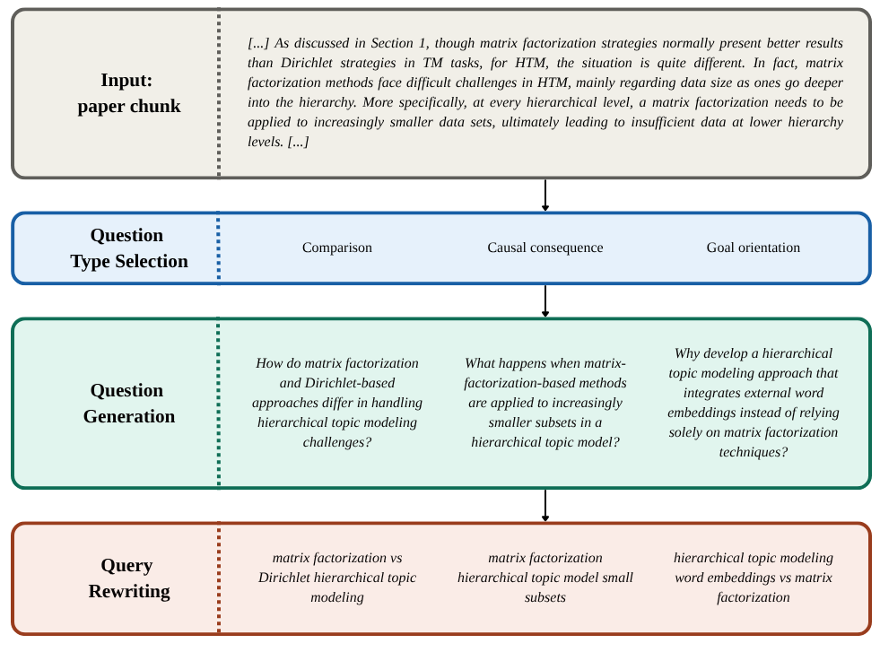

# ACL-Verbatim: Hallucination-Free Question Answering for NLP Researchers

*KR Labs · May 2026*

---

If you've ever used an AI assistant to search through research papers, you've probably run into the
same frustrating problem: the system sounds confident, cites a plausible-looking paper, and then
you check — and the detail it described doesn't quite exist in the source (if the source even
exists). This is the hallucination problem, and for researchers who need to trust their tools, it's
a dealbreaker. KR Labs has built [VerbatimRAG](https://huggingface.co/blog/adaamko/verbatimrag) for
transparent and trustworthy question answering, and you can now use it to search through all papers
in the ACL Anthology, the primary resource for research on natural language processing. Let's start
with some highlights:

- You can start querying NLP papers via **ACL-Verbatim** right now by going to **[verbatim.krlabs.eu](https://verbatim.krlabs.eu)**
- The **markdown version of all papers** in the ACL Anthology are released publicly as [KRLabsOrg/acl-anthology-md](https://huggingface.co/datasets/KRLabsOrg/acl-anthology-md) under CC
BY 4.0 (114K papers as of February 2026 and growing).
- All components are **free and open-source**. The [acl-verbatim](https://github.com/KRLabsOrg/acl-verbatim) repo can serve as a blueprint for deploying [verbatim-rag](https://github.com/KRLabsOrg/acl-verbatim) on any document collection.
- We also release our state-of-the-art **extraction models** and the underlying **span datasets**
    - [`KRLabsOrg/acl-verbatim-modernbert`](https://huggingface.co/KRLabsOrg/verbatim-rag-modern-bert-v1) has been trained on gold spans of the ACL data, released as [`acl-verbatim-spans`](https://huggingface.co/datasets/KRLabsOrg/acl-verbatim-spans)
    - [`KRLabsOrg/verbatim-rag-modern-bert-v2`](https://huggingface.co/KRLabsOrg/verbatim-rag-modern-bert-v2) is its generic counterpart trained on our multi-domain [`KRLabsOrg/verbatim-spans`](https://huggingface.co/datasets/KRLabsOrg/verbatim-spans) dataset

---

## What Is ACL-Verbatim?

ACL-Verbatim is an end-to-end question answering system over the [ACL
Anthology](https://aclanthology.org/) — the public library of 120,000+ papers in computational
linguistics and NLP — built on top of the [VerbatimRAG](https://github.com/KRLabsOrg/acl-verbatim)
framework. Instead of having a language model *generate* an answer (and risk fabricating details),
ACL-Verbatim identifies and returns **exact verbatim spans** from retrieved documents that are most
relevant to your query.

No paraphrasing. No synthesis. No hallucinations.

If the answer is in the ACL Anthology, the system should find the paper, retrieve the relevant
section, and highlight the precise passage that addresses your question. If it isn't there — or if
no retrieved chunk is sufficiently relevant — the system should tell you so, rather than making
something up.

---

## What We Built and Released

### 1. 114,000+ Papers Converted to Markdown

The backbone of the system is a large-scale conversion of the ACL Anthology to machine-readable
markdown. Starting from the February 2026 snapshot of the Anthology — 120,034 paper entries,
mapping to 114,567 PDFs under a permissive CC BY 4.0 license — we used the open-source
[Docling](https://docling-project.github.io/docling/) library to convert every PDF to markdown.

The result: **114,475 markdown files** covering the full text of papers including headers, tables,
lists, and figure captions, with other non-text elements replaced by placeholder annotations.

These files are released publicly on Hugging Face at
[KRLabsOrg/acl-anthology-md](https://huggingface.co/datasets/KRLabsOrg/acl-anthology-md) under CC
BY 4.0. Whether you want to build your own retrieval system, study the structure of NLP papers at
scale, or train document-understanding models, this is a resource you can use freely.

Papers are indexed using a custom chunking strategy built specifically for research papers: it
respects section boundaries, prefixes each chunk with section/subsection titles for better
retrieval, prevents tables and code blocks from being split, and controls chunk size (500–5,000
characters). Chunks are indexed both for full-text and dense vector search using IBM's
`granite-embedding-english-r2` embeddings.

---

### 2. A Ground Truth Dataset for Extractive QA over Research Papers

The harder and more novel contribution is a manually annotated benchmark for the task of
*extractive question answering* from research papers: given a user query and a retrieved chunk,
which spans of text in that chunk best answer the query?

We created a pipeline that generates **synthetic queries** based on the [ScIRGen
methodology](https://dl.acm.org/doi/10.1145/3711896.3737432). For each sampled paper, a random
chunk is selected, and an LLM generates question types and questions for that chunk, which are then
rewritten into short, search-engine-style queries. This three-step pipeline produced 906 queries
across 333 papers. Here is an example:

The **manually annotated portion** of the dataset consists of 100 query–chunk
pairs (20 queries × top-5 retrieved chunks), annotated by NLP researchers. For each chunk,
annotators:

- Made a **binary relevance judgment**: is this chunk relevant to the query at all?
- For relevant chunks, **highlighted the specific spans** most useful for answering the query.

This is genuinely hard work. The annotation task demands domain knowledge, careful reading, and
judgment calls about what counts as a "useful" span versus merely related text. You can read more
on the challenges of this task in our [paper](https://arxiv.org/abs/2605.21102). The final benchmark — 47 relevant chunks with
78 gold evidence spans, and 53 irrelevant chunks — is small by the standards of NLP datasets, but
it's gold-standard quality for a genuinely difficult task. All code for query generation and
annotation is on [GitHub](https://github.com/KRLabsOrg/acl-verbatim).

---

### 3. A Custom ACL Extraction Model (150M Parameters)

To power the extraction step in ACL-Verbatim, we trained a compact student model on **silver
supervision** generated from our pipeline: 20,916 training rows derived from 2,000 sampled papers,
with Qwen 3.6 35B as the silver teacher.

The architecture is a **query-conditioned binary token classifier** over an 8,192-token ModernBERT
backbone. The input is the concatenation of the query and the retrieved chunk; the output is a
binary evidence label per token, decoded into character spans. The final released model,
[`KRLabsOrg/acl-verbatim-modernbert`](https://huggingface.co/KRLabsOrg/verbatim-rag-modern-bert-v1), uses the `gte-reranker-modernbert-base` cross-encoder backbone
— a strong choice because it has been post-trained on query–passage relevance, which is exactly the
signal we care about.

On our gold benchmark, this 150M-parameter model achieves **Word-F1 of 53.6**, outperforming every
evaluated LLM extractor. The table below shows word-level F1 scores, more detailed metrics are
available in the [paper](https://arxiv.org/abs/2605.21102).

| Model | Word-F1 | Parameters |
|---|---|---|
| **ACL-Verbatim ModernBERT** | **53.6** | **150M** |
| GLM-5 | 48.7 | ~100B+ |
| Mistral Small 2603 | 46.9 | ~22B |
| Qwen 3.6 35B (paragraph prompt) | 46.7 | 35B |

Three to four orders of magnitude fewer parameters, and still the best performance. The improvement
comes from substantially **higher precision**. Unlike LLM extractors, our model abstains on irrelevant chunks rather than extracting
plausible-sounding but off-topic text. On the 53 irrelevant chunks in the evaluation set, our model
predicted no spans for 60 out of 100 total chunks, compared to only 35 abstentions for the
paragraph-style Mistral model.

For a RAG system, **high-precision extraction is exactly what you want**: it means fewer false
positives surfaced to the user, not just more relevant text highlighted.

---

### 4. A Generic Multi-Domain Extraction Model

Alongside the ACL-specialized model, we also release
[**`KRLabsOrg/verbatim-rag-modern-bert-v2`**](https://huggingface.co/KRLabsOrg/verbatim-rag-modern-bert-v2) —
a multi-domain sibling trained on a broader mixture of span-level annotations, released as
[`KRLabsOrg/verbatim-spans`](https://huggingface.co/datasets/KRLabsOrg/verbatim-spans). This
dataset contains:

- Our ACL silver data
- [RAGBench](https://arxiv.org/abs/2407.11005) — a large-scale RAG benchmark across industry
  domains
- [Squeez](https://arxiv.org/abs/2604.04979) — a task-conditioned tool-output pruning dataset for
  coding agents

This model achieves Word-F1 of **46.3** on our ACL gold benchmark — competitive with the best LLM
extractors despite not being specialized for NLP papers — and outperforms other context pruning models
such as [Zilliz Semantic Highlight](https://huggingface.co/blog/zilliz/zilliz-semantic-highlight-model) and [Provence](https://huggingface.co/blog/nadiinchi/provence) on RAGBench, Squeez, and QASPER (a scientific QA benchmark used as an out-of-domain test set).

If you want to apply the VerbatimRAG approach to your own domain — medical literature, legal
documents, internal company knowledge bases — the generic model provides a strong starting point
that you can fine-tune further on domain-specific data.

---

## Try It

The full ACL-Verbatim application is live at **[verbatim.krlabs.eu](https://verbatim.krlabs.eu)**.

All code, models, and data are open:

- **Application & pipeline**:
  [github.com/KRLabsOrg/acl-verbatim](https://github.com/KRLabsOrg/acl-verbatim)
- **Paper**:
  [ACL-Verbatim: hallucination-free question answering for research](https://arxiv.org/abs/2605.21102)
- **Markdown corpus**:
  [KRLabsOrg/acl-anthology-md](https://huggingface.co/datasets/KRLabsOrg/acl-anthology-md)
- **ACL model**:
  [KRLabsOrg/acl-verbatim-modernbert](https://huggingface.co/KRLabsOrg/acl-verbatim-modernbert)
- **Generic model**:
  [KRLabsOrg/verbatim-rag-modern-bert-v2](https://huggingface.co/KRLabsOrg/verbatim-rag-modern-bert-v2)

Questions, feedback, and pull requests are all welcome.

---

*ACL-Verbatim was built in collaboration by [KR Labs](https://krlabs.eu/) and the [TU Wien Data Science
Research Unit](https://informatics.tuwien.ac.at/orgs/e194-04).
Work partially supported by the [CLEAR project](https://www.k-pass.at/en/financed-proposals/detail/clear-comprehensible-learning-for-entity-anonymization-and-recognition/), funded within the Cybersecurity Programme Kybernet-Pass of the Austrian Federal Ministry of Finance.*
